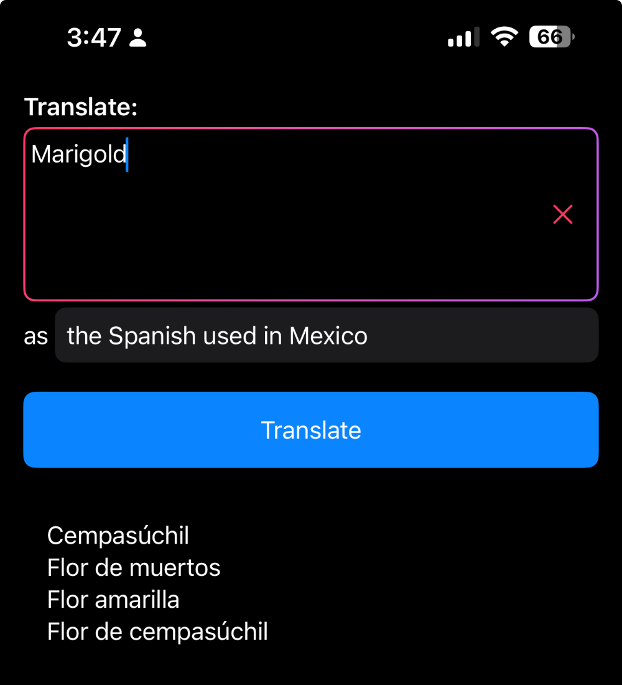

# Quadslator

Quadslator is a macOS application that provides multiple translation options for your text simultaneously, helping you choose the most appropriate translation for your context.



## Features

- Get multiple translations for any text
- Prioritized translations with most popular/widely used options first

## Setup

### Configuration

1. Copy the sample configuration file:
```bash
cp Quadslator/openai-config.json.sample Quadslator/openai-config.json
```

2. Edit `Quadslator/openai-config.json` with your Azure OpenAI credentials:
```json
{
    "apiUrl": "https://your-resource-name.openai.azure.com/openai/deployments/your-deployment-name/chat/completions?api-version=2024-08-01-preview",
    "apiKey": "your-api-key-here",
    "translationPrompt": "Provide four translations in {targetLanguage} for the following text, put the most popular and widely used translation first, only return the translations, don't enumerate, just one translation per line plain text: {text}."
}
```

Replace:
- `your-resource-name` with your Azure OpenAI resource name
- `your-deployment-name` with your GPT-4 deployment name
- `your-api-key` with your Azure OpenAI API key

## Development

### Requirements

- Xcode 15.0 or later
- macOS 14.0 or later
- Azure OpenAI API access with GPT-4 deployment

### Building

1. Open `Quadslator.xcodeproj` in Xcode
2. Configure the signing certificate in project settings
3. Build and run the project

## Usage

1. Enter the text you want to translate in the main text field
2. Specify the target language in the "as" field (e.g., "Spanish used in Mexico", "French popular in Quebec", "Chinese used in Taiwan"). You should be as specific as possible, as different locations will give you different results. 
3. Click "Translate" to get multiple translation options
4. The translations will be displayed in order of popularity/common usage

## License

This project is licensed under the MIT License - see the LICENSE file for details.